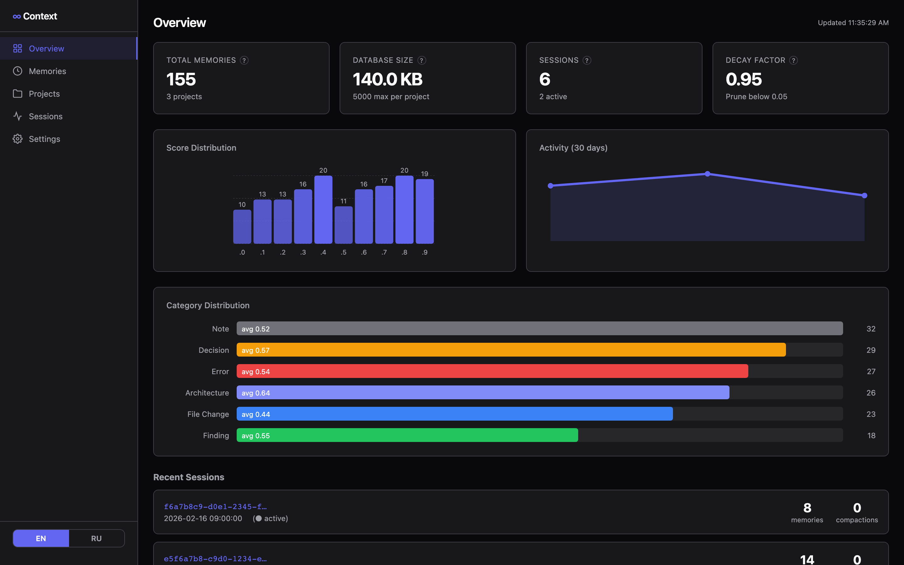
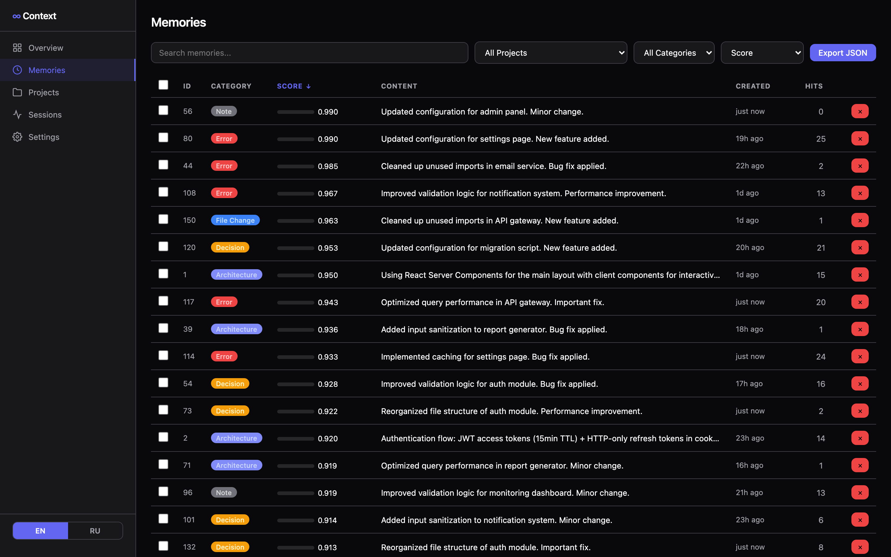
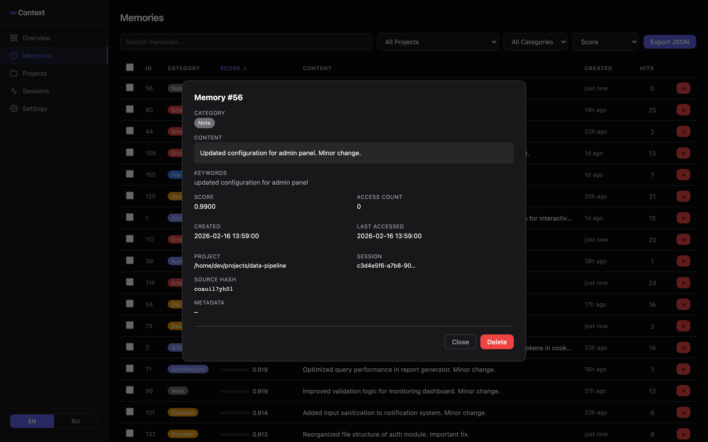
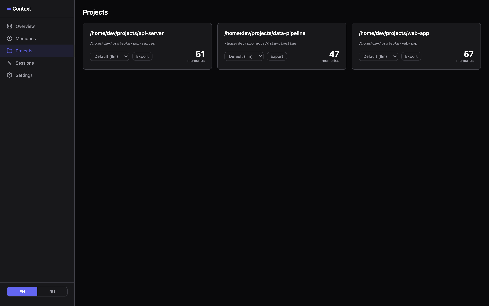
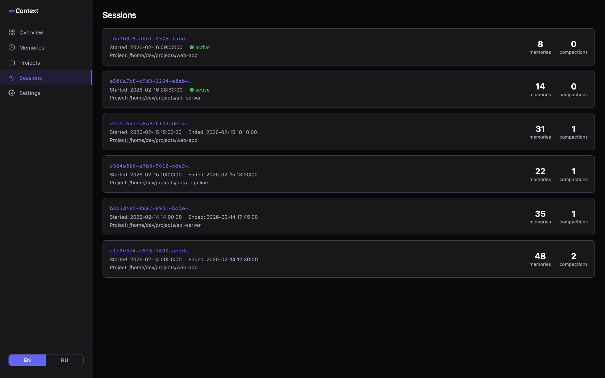
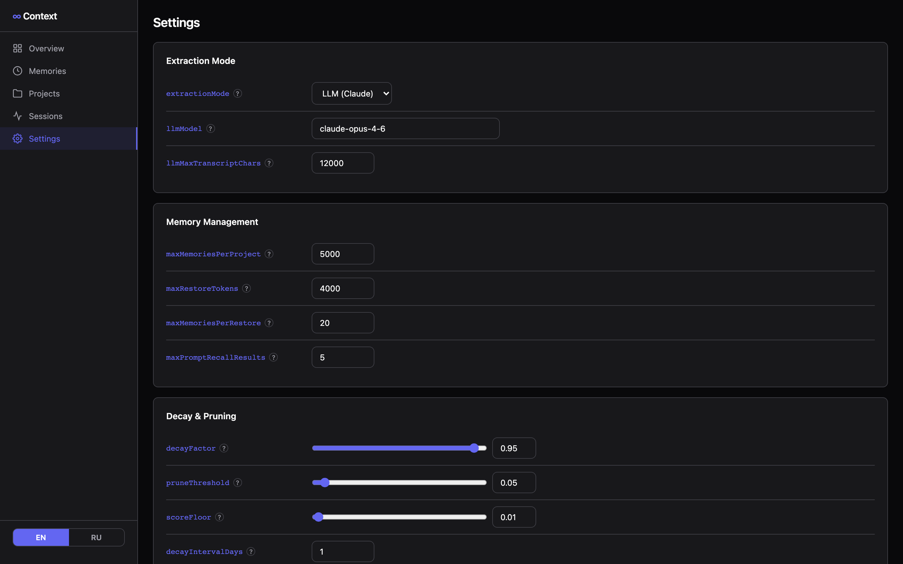

# infinite-context

Persistent memory for Claude Code. Archives context before compaction, restores it after, and provides proactive recall across sessions.

## Problem

Claude Code loses all accumulated context when compaction triggers. Long sessions, complex projects, multi-step debugging — everything gets compressed away. Start a new session and you're back to zero.

## Solution

`infinite-context` hooks into Claude Code's lifecycle events to:

- **Archive** decisions, file changes, errors, and findings into SQLite before compaction
- **Restore** the most important memories after compaction or session start
- **Recall** relevant context proactively on every prompt via FTS5 full-text search
- **Support agents** — subagents spawned via Task tool receive project context automatically
- **Web dashboard** — browse, search, and manage memories via `ic dashboard`
- **Rollback-safe** — handles message editing (double-ESC) without orphaning memories
- **Dual extraction** — regex-based rules, LLM-powered analysis via Anthropic API, or hybrid mode

One dependency (`better-sqlite3`), ~18 source files, installs in seconds.

## Install

```bash
git clone https://github.com/Elizarfish/infinite-context.git
cd infinite-context
npm install
node src/cli.js install
```

Restart Claude Code. Done.

## Uninstall

```bash
node src/cli.js uninstall
```

Hooks are removed, existing hooks untouched, data preserved.

## How It Works

Six hooks registered in `~/.claude/settings.json`:

| Hook | Event | What it does |
|------|-------|-------------|
| `pre-compact.js` | PreCompact | Parses transcript, extracts memories, archives to SQLite |
| `session-start.js` | SessionStart | Restores top memories (by importance score) into context |
| `user-prompt-submit.js` | UserPromptSubmit | FTS5 keyword search, injects relevant memories |
| `session-end.js` | SessionEnd | Final archive pass, score decay, pruning |
| `subagent-start.js` | SubagentStart | Injects project context into Task-spawned agents |
| `subagent-stop.js` | SubagentStop | Archives subagent transcript into memory DB |

### Extraction Modes

Memories can be extracted in three ways, configurable globally or per-project:

| Mode | How it works | Tradeoff |
|------|-------------|----------|
| **Rules** (default) | Regex patterns detect file changes, errors, decisions, architecture notes | Fast, free, no API calls. May miss nuance. |
| **LLM** | Sends transcript to Anthropic API; the model decides what's important | Smarter extraction, costs API tokens. Requires `ANTHROPIC_API_KEY`. |
| **Hybrid** | Runs both rules and LLM, merges results with deduplication | Best coverage, higher cost. |

### Memory Scoring

Each memory gets an importance score based on:
- **Category weight** — architecture (1.0) > decisions (0.9) > errors (0.8) > findings (0.7) > file changes (0.5) > notes (0.4)
- **Recency** — exponential decay with configurable half-life
- **Access frequency** — log-scaled, memories that get recalled often stay alive
- **Score decay** — unused memories decay daily, pruned when below threshold

### Storage

- SQLite with WAL mode for concurrent access
- FTS5 virtual table for full-text keyword search
- Incremental transcript parsing via checkpoints (only new lines since last parse)
- SHA-256 content hashing for deduplication
- Per-project memory isolation (keyed by `cwd`)

## CLI

```bash
ic install                        # Install hooks
ic uninstall                      # Remove hooks (data preserved)
ic status                         # Show stats: memory count, DB size, projects
ic search <keywords>              # FTS5 search across memories
ic search <keywords> --project .  # Search within specific project
ic export                         # Export all memories as JSON
ic export --project .             # Export specific project
ic prune                          # Decay scores and prune low-value memories
ic prune --older-than 30          # Prune memories older than N days (never accessed)
ic prune --below-score 0.1        # Prune below score threshold
ic prune --dry-run                # Preview what would be pruned
ic dashboard                      # Start web dashboard on port 3333
ic dashboard --port 8080          # Custom port
ic config                         # Show current configuration
```

## Web Dashboard

```bash
ic dashboard              # http://localhost:3333
ic dashboard --port 8080  # Custom port
```

Interactive web interface for monitoring and managing memories. Supports English and Russian (toggle in sidebar).

### Overview



The main dashboard page. At a glance you see:
- **Total memories** across all projects and database size
- **Sessions** count with active sessions highlighted
- **Decay factor** and pruning threshold
- **Score distribution** histogram — shows how memories are spread across relevance scores (0–1)
- **Activity chart** — memory creation over the last 30 days
- **Category distribution** — bar chart with counts and average scores per category (architecture, decision, error, finding, file change, note)
- **Recent sessions** — latest coding sessions with memory and compaction counts

### Memories



Browse, search, and manage all stored memories:
- **Full-text search** — search across memory content
- **Filter by project** — dropdown with all tracked projects
- **Filter by category** — architecture, decision, error, finding, file change, note
- **Sort** — by score, creation date, last accessed, or access count
- **Bulk operations** — select multiple memories with checkboxes and delete in batch
- **Export** — download filtered results as JSON
- **Score visualization** — color-coded progress bars (green = high, red = low)

Click any memory to open the detail modal:



The detail view shows the full memory content, extracted keywords, score, access count, timestamps, associated project and session, source hash, and metadata. You can delete individual memories from here.

### Projects



All tracked projects displayed as cards:
- **Memory count** per project
- **Extraction mode selector** — set Rules, LLM, or Hybrid mode per project (overrides global setting)
- **Export** — download all memories for a specific project as JSON
- Click a project card to jump to its filtered memories view

### Sessions



Timeline of all coding sessions:
- **Session ID** and start time
- **Active/ended** status indicator
- **Project path** associated with each session
- **Memories created** and **compactions** count per session

### Settings



All configuration parameters editable from the web interface:

**Extraction Mode** — choose between Rules (regex), LLM (Claude), or Hybrid. Configure the LLM model and max transcript size sent per extraction.

**Memory Management** — set limits for memories per project, restore token budget, memories per restore, and prompt recall results.

**Decay & Pruning** — adjust decay factor, prune threshold, score floor, and decay interval with sliders.

**Category Weights** — tune importance weights for each memory category (architecture, decision, error, finding, file change, note).

**Maintenance** — run decay & prune operations or prune old unused memories directly from the UI.

### REST API

The dashboard exposes a REST API:

| Endpoint | Method | Description |
|----------|--------|-------------|
| `/api/stats` | GET | Database statistics, category counts, score distribution, timeline |
| `/api/memories` | GET | Paginated memories with search, filter, sort |
| `/api/memories/:id` | GET | Single memory detail |
| `/api/memories/:id` | DELETE | Delete a memory |
| `/api/memories/bulk-delete` | POST | Bulk delete by IDs |
| `/api/projects` | GET | Project list with memory counts |
| `/api/project-config` | PUT | Set per-project extraction mode |
| `/api/sessions` | GET | Session list |
| `/api/config` | GET | Current configuration |
| `/api/config` | PUT | Update configuration |
| `/api/prune/preview` | GET | Preview prune operation |
| `/api/prune` | POST | Execute prune |

## Configuration

Optional. Create `~/.claude/infinite-context/config.json`:

```json
{
  "extractionMode": "rules",
  "llmModel": "claude-opus-4-6",
  "llmMaxTranscriptChars": 12000,
  "maxRestoreTokens": 4000,
  "maxMemoriesPerRestore": 20,
  "maxPromptRecallResults": 5,
  "decayFactor": 0.95,
  "decayIntervalDays": 1,
  "pruneThreshold": 0.05,
  "scoreFloor": 0.01,
  "maxMemoriesPerProject": 5000,
  "categoryWeights": {
    "architecture": 1.0,
    "decision": 0.9,
    "error": 0.8,
    "finding": 0.7,
    "file_change": 0.5,
    "note": 0.4
  },
  "projects": {
    "/path/to/project": {
      "extractionMode": "llm"
    }
  }
}
```

All fields optional — defaults are sensible. Configuration can also be edited via the web dashboard Settings page.

| Field | Default | Description |
|-------|---------|-------------|
| `extractionMode` | `"rules"` | Global extraction mode: `rules`, `llm`, or `hybrid` |
| `llmModel` | `"claude-opus-4-6"` | Model for LLM extraction (requires `ANTHROPIC_API_KEY`) |
| `llmMaxTranscriptChars` | `12000` | Max transcript characters sent to the LLM per extraction |
| `maxRestoreTokens` | `4000` | Token budget for context restoration |
| `maxMemoriesPerRestore` | `20` | Max memories loaded at session start |
| `maxPromptRecallResults` | `5` | Max results from per-prompt recall |
| `decayFactor` | `0.95` | Score multiplier per decay interval (0.95 = -5%) |
| `decayIntervalDays` | `1` | Days of inactivity before decay applies |
| `pruneThreshold` | `0.05` | Memories below this score get deleted |
| `scoreFloor` | `0.01` | Minimum score a memory can decay to |
| `maxMemoriesPerProject` | `5000` | Max memories stored per project |
| `categoryWeights` | see above | Importance multiplier per memory category |
| `projects` | `{}` | Per-project overrides (e.g. extraction mode) |

## Project Structure

```
src/
  cli.js                     # CLI interface
  install.js                 # Hook registration/removal
  core/
    config.js                # Configuration with defaults and per-project overrides
    transcript-parser.js     # JSONL transcript parser with checkpoints
    archiver.js              # Rule-based memory extraction from conversation turns
    llm-archiver.js          # LLM-powered memory extraction via Anthropic API
    scorer.js                # Scoring, importance ranking, keyword extraction
    restorer.js              # Context restoration within token budget
  db/
    store.js                 # SQLite layer — FTS5, prepared statements, WAL
  hooks/
    common.js                # Shared hook utilities
    pre-compact.js           # Archive before compaction
    session-start.js         # Restore after compaction/start
    user-prompt-submit.js    # Proactive recall per prompt
    session-end.js           # Final archive + cleanup
    subagent-start.js        # Inject context into subagents
    subagent-stop.js         # Archive subagent transcripts
  web/
    server.js                # Dashboard HTTP server + REST API
    index.html               # Single-page dashboard app (EN/RU)
tests/
  store.test.js              archiver.test.js
  restorer.test.js           scorer.test.js
  transcript-parser.test.js  install.test.js
  integration.test.js        hook-contract.test.js
  edge-cases.test.js         regression.test.js
  stress.test.js             concurrency.test.js
  real-transcript.test.js    coverage-gaps.test.js
docs/
  screenshots/               # Dashboard screenshots
```

## Requirements

- Node.js >= 20
- Claude Code with hooks support
- `ANTHROPIC_API_KEY` environment variable (only for LLM/hybrid extraction mode)

## Data

Stored in `~/.claude/infinite-context/memories.db`. Survives uninstall. Delete manually if needed:

```bash
rm -rf ~/.claude/infinite-context/
```

## License

MIT
